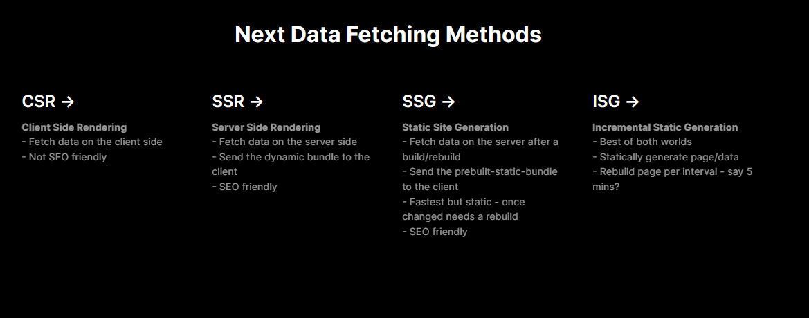

# Next.js Data Fectching Methods in Typescript

In this repo you will find all the data fetching methods like: 
- Server sider rendering (ssr.tsx), 
- Static site generation (ssg.tsx), 
- Incremental static regeneration (isg.tsx) and 
- Basic react client-side rendering (csr.tsx).

## Getting Started

First, run the development server:

```bash
npm run dev
# or
yarn dev
# or
pnpm dev
```
# Home Page



